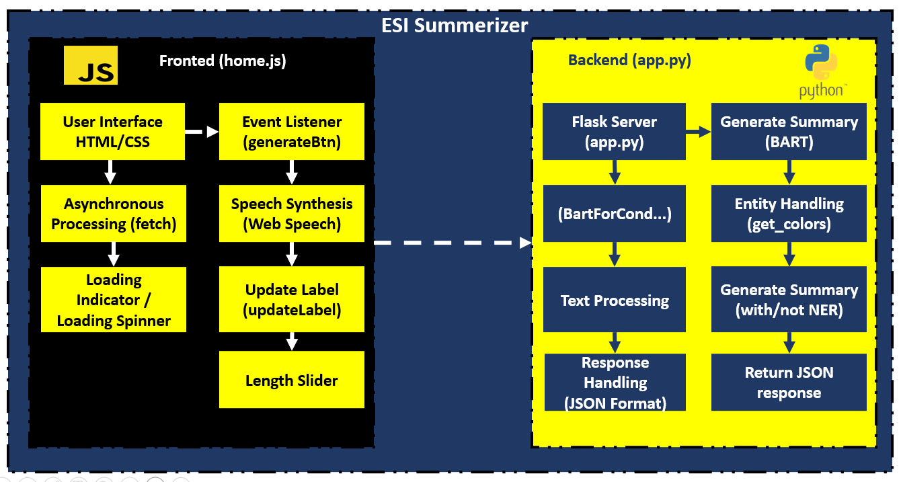
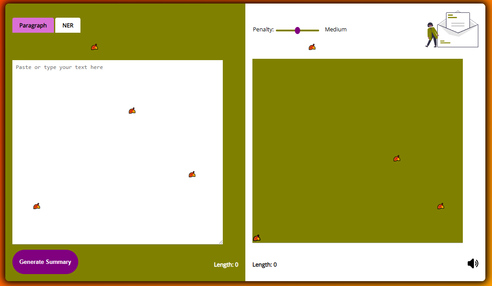

# Text Summarization Project

## Overview

This project focuses on text summarization, utilizing a combination of web scraping, data cleaning, and training various models, including BERT, LSTM with encoder-decoder architecture, and Pegasus. The highlight of the project is the modification of the BERT model to incorporate entity recognition for improved context comprehension.

## Project Structure

The project is organized into the following folders:

- **data:** Contains the datasets obtained through web scraping.
- **notebooks:** Holds Jupyter notebooks used for data cleaning, model training, and experimentation.
- **report_and_presentation:** Includes documentation and presentation materials.
- **summary_app:** Houses the application for easy access to the summarization model.

## Workflow

1. **Data Collection:**
   - Gathered diverse data from online sources using web scraping techniques.

2. **Data Cleaning:**
   - Cleaned and preprocessed the collected data to create a refined corpus.

3. **Model Training:**
   - Trained various models, including BERT, LSTM with encoder-decoder, and Pegasus, for news article summarization.

4. **Model Improvement:**
   - Enhanced the performance of the BERT model by modifying its architecture. Added layers for entity recognition to improve context understanding.

5. **Deployment:**
   - Deployed the optimized model (RertENR) with a user-friendly interface.

## Application Deployment

To use the summarization application:

1. Clone the project repository.
2. Navigate to the "Summary_app" folder.
3. Install the required dependencies using `pip install -r requirements.txt`.
4. Run the Flask app with the command `python app.py`.

Now, you have your own news summary application accessible through a friendly user interface.

## Contributing

Contributions to this project are welcome! Feel free to submit issues or pull requests.

## License

This project is licensed under the [MIT License](LICENSE).

## Acknowledgments

We appreciate the contributions of the team members:
- [Soufiane Elghasi](https://github.com/SoufianeElghazi)
- [Amin Masseri](https://github.com/AmineMsr)

who worked on different aspects of the project.
